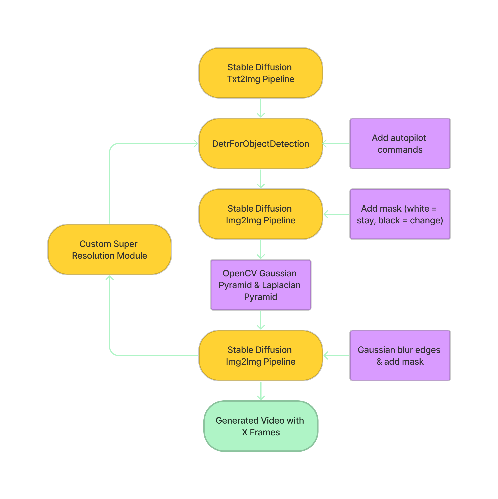

<h1 align="center">Innovating Text-to-Video Generation with Improved Coherence and Logic</h1>

<br>

## Drone View V2
The [Drone View V2](https://github.com/FredZhang7/Astro-Diffusion/wiki/Drone-View-V2) feature enables you to create a video with a duration of your choice from a drone's perspective by providing a description or prompt for a scene. While the drone is set to autopilot mode, you can modify its movements and responses to obstacles inside the `DroneArgs` class. See the playlist below for examples of video outputs.




Just a heads up, the art style in the videos are, for the most part, determined by the text-to-image model you choose, and is not influenced by Astro Stable Diffusion methods.

Text-to-video generation for Drone View V3, Virtual Reality, Panorama Photography, and Pan Shot are currently being developed.

## Examples

<a href="https://www.youtube.com/playlist?list=PLCFlAfr2X8n2BxB9ZgKOVTG1WggWpnts0">
  
</a>


<br>

## Setup
Download the required packages and repositories.
```
pip install -r requirements.txt
git clone https://github.com/AUTOMATIC1111/stable-diffusion-webui.git
```
Download and save a Stable Diffusion model to the `./stable-diffusion-webui/models/Stable-diffusion` folder. Lastly, launch `webui-user.bat` in `./stable-diffusion-webui` before running Astro Stable Diffusion plugins.

<br>


## Notes
This repository is similar to [Deforum Stable Diffusion](https://colab.research.google.com/github/deforum/stable-diffusion/blob/main/Deforum_Stable_Diffusion.ipynb) in that both are based on the image-to-image and text-to-image methods of Stable Diffusion. However, Astro Stable Diffusion differs in that it uses non-interpolation methods to create videos.

Earlier work has been moved to the [previous](./previous) folder, but it still provides useful AI Art helpers.


## Inspirations
```
@article{Forsgren_Martiros_2022,
  author = {Forsgren, Seth* and Martiros, Hayk*},
  title = {{Riffusion - Stable diffusion for real-time music generation}},
  url = {https://riffusion.com/about},
  year = {2022}
}
```
```
@article{DBLP:journals/corr/abs-2005-12872,
  author    = {Nicolas Carion and
               Francisco Massa and
               Gabriel Synnaeve and
               Nicolas Usunier and
               Alexander Kirillov and
               Sergey Zagoruyko},
  title     = {End-to-End Object Detection with Transformers},
  journal   = {CoRR},
  volume    = {abs/2005.12872},
  year      = {2020},
  url       = {https://arxiv.org/abs/2005.12872},
  archivePrefix = {arXiv},
  eprint    = {2005.12872},
  timestamp = {Thu, 28 May 2020 17:38:09 +0200},
  biburl    = {https://dblp.org/rec/journals/corr/abs-2005-12872.bib},
  bibsource = {dblp computer science bibliography, https://dblp.org}
}
```
